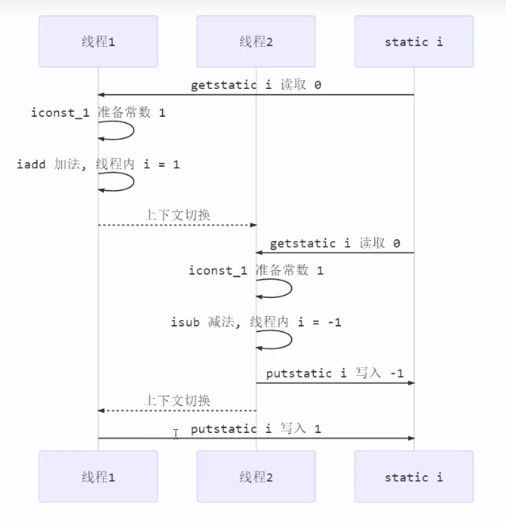

## 一、共享带来的问题

```java
    public  static  int count=0;

    public static void main(String[] args) throws  Exception {

        Thread thread1 = new Thread(() -> {
            for (int i = 0; i < 5000; i++) {
                count--;
            }
        });
        Thread thread2 = new Thread(() -> {
            for (int i = 0; i < 5000; i++) {
                count++;
            }
        });
        thread1.start();
        thread2.start();
        thread1.join();
        thread2.join();

        System.out.println("count的值：" + count );
    }
```

```
执行上面的方法，我们会认为最后count的值是0
但是执行结果有正的有负的，不一定是0
这是为什么呢？ 
原因就是++ 和 --操作不是原子操作 
假设thread1拿到CPU的时间片，对count进行 -- 操作此时的count应该是-1 但是往内存中写入的之前 thread1失去了CPU的时间片， thread2拿到count的值是0，他进行自增后的值是1 这时就乱了

```



## 二、临界区

· 一个程序运行多个线程本身是没有问题的

· 问题出在多个线程访问共享资源

​	· 多个线程读共享资源其实也没有问题

​	· 在多个线程对共享资源进行写操作是发生指令交错，就会出现问题

· 一段代码内如果存在对共享资源的多线程读写操作，称这个代码块为**临界区**

```
上述代码的 count++ count-- 就是对共享资源的读写操作的代码块，就是临界区
```

**竞态条件**

​	多个线程在临界区内执行，由于执行代码的执行序列不同而导致结果无法预估，就是发生了竞态条件


## 三、synchronized解决方案

为了避免临界区的竞态条件发生，有多种手段可以达到目的

>· 阻塞式解决方案， synchronized Lock
>
>· 非阻塞式的解决方案 原子 变量

需要注意的是 

​	虽然java中国互斥和同步都可以使用synchronized关键字来完成，但是它们之间是有区别的

>· 互斥是保证临界区的竞态条件发生，同一时刻只能有一个线程执行临界区代码
>
>· 同步是由于线程执行的先后，顺序不同，需要一个线程等待其他线程运行到某个点

```java
    public  static  int count=0;

    static final  Object lock = new Object();
    public static void main(String[] args) throws  Exception {
        Thread thread1 = new Thread(() -> {
            for (int i = 0; i < 5000; i++) {
                synchronized (lock){
                    count--;
                }

            }
        });
        Thread thread2 = new Thread(() -> {
            for (int i = 0; i < 5000; i++) {
                synchronized (lock){
                    count++;
                }
            }
        });
        thread1.start();
        thread2.start();
        thread1.join();
        thread2.join();
        System.out.println("count的值：" + count );
    }

//执行结果永远是0
```

改造代码

```java
public class ThreadTest2 {

    public static void main(String[] args) throws Exception{
        Lock lock = new Lock();
        Thread thread1 = new Thread(() -> {
            for (int i = 0; i <5000 ; i++) {
                lock.increament();
            }
        });
        Thread thread2 = new Thread(() -> {
            for (int i = 0; i <5000 ; i++) {
                lock.decreament();
            }
        });
        thread1.start();
        thread2.start();
        thread1.join();
        thread2.join();

        System.out.println("count的值是：" +lock.getCount());
    }
}

class Lock{
    private int count=0;

    public void increament(){
        synchronized (this){
            count++;
        }
    }
    public void decreament(){
        synchronized (this){
            count--;
        }
    }

    public int getCount(){
        synchronized (this){
            return this.count;
        }
    }
}
```

**在非静态方法上加入synchronized关键字就是在这个方法内使用该对象作为锁**

```java
class Lock2{
    private int count=0;

    public synchronized  void increament(){
        count++;
    }
    public synchronized void decreament(){
        count--;
    }

    public synchronized int getCount(){
        return this.count;
    }
}
```

**如果在静态方法上加入synchronized关键字就相当于在方法中使用Lock2.class对象最为锁**

## 三、卖票案例

```java
class TicketWindow{
    private int count;

    public TicketWindow(int count){
       this.count=count;
    }

    public int getCount(){
        return count;
    }

    public int sell(int sellCount){
       if (this.count>sellCount) {
           this.count -= sellCount;
           return sellCount;
       } else {
           return 0;
       }
    }
}
```


```java 
public class SellTicketTest {

    public static void main(String[] args) throws Exception {
        TicketWindow ticketWindow = new TicketWindow(5000);

        //卖出票的集合
        List<Integer> amountList = new Vector<>();

        //线程集合
        List<Thread> threadList = new ArrayList<>();

        for (int i = 0; i <3000 ; i++) {
            Thread thread = new Thread(() -> {
                // 此处也用到了共享变量，但没有对共享变量做出读写操作 所以是线程安全的
                // 出现线程安全的地方就是sell方法内部
                int sell = ticketWindow.sell(randomCount());
                //  统计卖票数 这里有共享变量 会存在线程安全问题 因为用的是vector 是线程安全的
                amountList.add(sell);
            });
            threadList.add(thread);

            thread.start();
        }

        //等待买票完成统计
        for (Thread t: threadList
             ) {
          t.join();
        }
        System.out.println("余票： " + ticketWindow.getCount());
        System.out.println("卖出：" + amountList.stream().mapToInt(i -> i).sum());
    }

    static Random random = new Random();
    public static  int randomCount(){
        return  random.nextInt(5) + 1;
    }

}
运行结果
    余票： 1
    卖出：4999
   
    public int sell(int sellCount){
    	// 此处代码对共享变量进行了读写 在多线程中是不安全的 在此处加入锁
       if (this.count>sellCount) {
           this.count -= sellCount;
           return sellCount;
       } else {
           return 0;
       }
    }
 // 加入锁后就不会出现线程安全问题
 public synchronized int sell(int sellCount){
       if (this.count >= sellCount) {
           this.count -= sellCount;
           return sellCount;
       } else {
           return 0;
       }
    }
```


