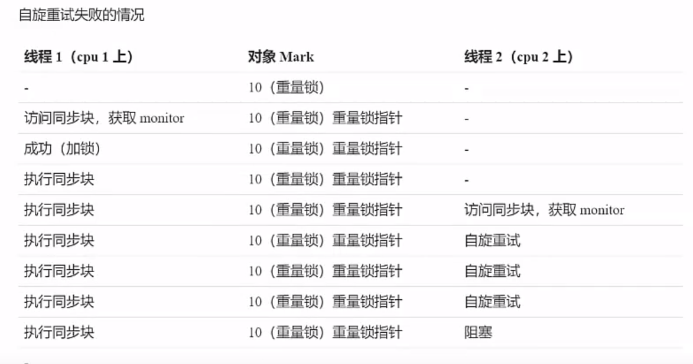

## 一、共享带来的问题

```java
    public  static  int count=0;

    public static void main(String[] args) throws  Exception {

        Thread thread1 = new Thread(() -> {
            for (int i = 0; i < 5000; i++) {
                count--;
            }
        });
        Thread thread2 = new Thread(() -> {
            for (int i = 0; i < 5000; i++) {
                count++;
            }
        });
        thread1.start();
        thread2.start();
        thread1.join();
        thread2.join();

        System.out.println("count的值：" + count );
    }
```

```
执行上面的方法，我们会认为最后count的值是0
但是执行结果有正的有负的，不一定是0
这是为什么呢？ 
原因就是++ 和 --操作不是原子操作 
假设thread1拿到CPU的时间片，对count进行 -- 操作此时的count应该是-1 但是往内存中写入的之前 thread1失去了CPU的时间片， thread2拿到count的值是0，他进行自增后的值是1 这时就乱了

```


## 二、临界区

· 一个程序运行多个线程本身是没有问题的

· 问题出在多个线程访问共享资源

​	· 多个线程读共享资源其实也没有问题

​	· 在多个线程对共享资源进行写操作是发生指令交错，就会出现问题

· 一段代码内如果存在对共享资源的多线程读写操作，称这个代码块为**临界区**

```
上述代码的 count++ count-- 就是对共享资源的读写操作的代码块，就是临界区
```

**竞态条件**

​	多个线程在临界区内执行，由于执行代码的执行序列不同而导致结果无法预估，就是发生了竞态条件


## 三、synchronized解决方案

为了避免临界区的竞态条件发生，有多种手段可以达到目的

>· 阻塞式解决方案， synchronized Lock
>
>· 非阻塞式的解决方案 原子 变量

需要注意的是 

​	虽然java中国互斥和同步都可以使用synchronized关键字来完成，但是它们之间是有区别的

>· 互斥是保证临界区的竞态条件发生，同一时刻只能有一个线程执行临界区代码
>
>· 同步是由于线程执行的先后，顺序不同，需要一个线程等待其他线程运行到某个点

```java
    public  static  int count=0;

    static final  Object lock = new Object();
    public static void main(String[] args) throws  Exception {
        Thread thread1 = new Thread(() -> {
            for (int i = 0; i < 5000; i++) {
                synchronized (lock){
                    count--;
                }

            }
        });
        Thread thread2 = new Thread(() -> {
            for (int i = 0; i < 5000; i++) {
                synchronized (lock){
                    count++;
                }
            }
        });
        thread1.start();
        thread2.start();
        thread1.join();
        thread2.join();
        System.out.println("count的值：" + count );
    }

//执行结果永远是0
```

改造代码

```java
public class ThreadTest2 {

    public static void main(String[] args) throws Exception{
        Lock lock = new Lock();
        Thread thread1 = new Thread(() -> {
            for (int i = 0; i <5000 ; i++) {
                lock.increament();
            }
        });
        Thread thread2 = new Thread(() -> {
            for (int i = 0; i <5000 ; i++) {
                lock.decreament();
            }
        });
        thread1.start();
        thread2.start();
        thread1.join();
        thread2.join();

        System.out.println("count的值是：" +lock.getCount());
    }
}

class Lock{
    private int count=0;

    public void increament(){
        synchronized (this){
            count++;
        }
    }
    public void decreament(){
        synchronized (this){
            count--;
        }
    }

    public int getCount(){
        synchronized (this){
            return this.count;
        }
    }
}
```

**在非静态方法上加入synchronized关键字就是在这个方法内使用该对象作为锁**

```java
class Lock2{
    private int count=0;

    public synchronized  void increament(){
        count++;
    }
    public synchronized void decreament(){
        count--;
    }

    public synchronized int getCount(){
        return this.count;
    }
}
```

**如果在静态方法上加入synchronized关键字就相当于在方法中使用Lock2.class对象最为锁**

## 四 、卖票案例

```java
class TicketWindow{
    private int count;

    public TicketWindow(int count){
       this.count=count;
    }

    public int getCount(){
        return count;
    }

    public int sell(int sellCount){
       if (this.count>sellCount) {
           this.count -= sellCount;
           return sellCount;
       } else {
           return 0;
       }
    }
}
```


```java 
public class SellTicketTest {

    public static void main(String[] args) throws Exception {
        TicketWindow ticketWindow = new TicketWindow(5000);

        //卖出票的集合
        List<Integer> amountList = new Vector<>();

        //线程集合
        List<Thread> threadList = new ArrayList<>();

        for (int i = 0; i <3000 ; i++) {
            Thread thread = new Thread(() -> {
                // 此处也用到了共享变量，但没有对共享变量做出读写操作 所以是线程安全的
                // 出现线程安全的地方就是sell方法内部
                int sell = ticketWindow.sell(randomCount());
                //  统计卖票数 这里有共享变量 会存在线程安全问题 因为用的是vector 是线程安全的
                amountList.add(sell);
            });
            threadList.add(thread);

            thread.start();
        }

        //等待买票完成统计
        for (Thread t: threadList
             ) {
          t.join();
        }
        System.out.println("余票： " + ticketWindow.getCount());
        System.out.println("卖出：" + amountList.stream().mapToInt(i -> i).sum());
    }

    static Random random = new Random();
    public static  int randomCount(){
        return  random.nextInt(5) + 1;
    }

}
运行结果
    余票： 1
    卖出：4999
   
    public int sell(int sellCount){
    	// 此处代码对共享变量进行了读写 在多线程中是不安全的 在此处加入锁
       if (this.count>sellCount) {
           this.count -= sellCount;
           return sellCount;
       } else {
           return 0;
       }
    }
 // 加入锁后就不会出现线程安全问题
 public synchronized int sell(int sellCount){
       if (this.count >= sellCount) {
           this.count -= sellCount;
           return sellCount;
       } else {
           return 0;
       }
    }
```

## 五、转账案例

```java 
class Account {
    // 余额
    private  int  balance;

    public Account(int balance){
        this.balance = balance;
    }

    public int getBalance(){
        return  this.balance;
    }

    public synchronized  void transfer(Account account, int  amount){
        if (this.balance >= amount) {
            account.balance += amount;
            this.balance -= amount;
        }
    }

}
```


```java
package transferAccount;

import java.util.Random;

public class ThreadTest {

    public static void main(String[] args) throws  Exception{
        Account account1 = new Account(1000);
        Account account2 = new Account(1000);

        Thread thread1 = new Thread(() -> {
            for (int i = 0; i < 1000; i++) {
                account1.transfer(account2, randomCount());
            }
        });
        Thread thread2 = new Thread(() -> {
            for (int i = 0; i < 1000; i++) {
                account2.transfer(account1, randomCount());
            }
        });

        thread1.start();
        thread2.start();

        thread1.join();
        thread2.join();

        System.out.println("total: " + (account1.getBalance()+account2.getBalance()) );
    }

    static Random random = new Random();
    public static  int randomCount(){
        return  random.nextInt(5) + 1;
    }
}

// 输出结果 
// total: 2024

public   void transfer(Account account, int  amount){
        synchronized (Account.class){
            if (this.balance >= amount) {
                account.balance += amount;
                this.balance -= amount;
            }
        }
}
```

## 六、monitor概念

每个java对象都可以关联一个Monitor对象，如果使用synchronized给 对象上锁(重量级)之后，该对象头的markword中就被设置指向monitor对象的指针

monitor对象结构图(monitor不是java中的，属于操作系统)


```
· 刚开始monitor中owner是null
· 当Thread-2执行synchronized(obj)就会将monitor中的owner设置为Thread-2(只能存一个值)
· 在Thread-2上锁过程中，如果Thread-3 Thread-4 Thread-5也执行了synchronized(obj)，那么这三个线程就会存进EntryList进入BLOCKED(阻塞状态)
· Thread-2执行完后释放锁(即将owner清空),然后唤醒EntryList中的线程进行竞争锁。竞争是非公平的
```

**注意事项**

```
· synchronized必须是进入同一个对象的monitor才能有效
· 不加synchronized的对象不会关联监视器，不遵从以上规则
```

### 字节码解释synchronized

```java
    private static  Object obj = new Object();

    private static  int counter = 0;

    public static void main(String[] args) {
        synchronized (obj){
            counter++;
        }
    }
```

```java
  public static void main(java.lang.String[]);
    descriptor: ([Ljava/lang/String;)V
    flags: ACC_PUBLIC, ACC_STATIC
    Code:
      stack=2, locals=3, args_size=1
         0: getstatic     #2                  // lock引用(synchronized开始)
         3: dup
         4: astore_1					   // lock引用copy到 slot 1 后面解锁使用
         5: monitorenter                     // 将lock对象放到markword 设置为monitor指针
         6: getstatic     #3                  // 
         9: iconst_1                         // 准备常数1
        10: iadd
        11: putstatic     #3                  // Field counter:I
        14: aload_1                          // lock引用
        15: monitorexit                      // 将lock对象markword重置，唤醒EntryList
        16: goto          24
        19: astore_2                         // 19 - 24 处理异常
        20: aload_1                          // lock引用
        21: monitorexit                
        22: aload_2
        23: athrow
        24: return
      Exception table:
         from    to  target type
             6    16    19   any           // 6-16 发生异常 就去执行19行
            19    22    19   any	      // 19-22发生异常  就去执行19行 保证锁可以被释放掉

```

如果每次都像操作系统获取锁资源，那么效率就会低下。1.6之后就开始优化synchronized

### synchronized原理进阶

#### 1、轻量级锁

```
轻量锁的应用场景： 如果一个对象虽然有多个线程访问，但是多个线程访问的时间是错开的，也就是没有线程与线程之间的竞争，那么就可以使用轻量级锁来进行优化。
```

```
轻量级锁对使用者是透明的，语法依旧是synchronized
```

```Java
    Object obj = new Object();

    public void method1(){
        synchronized (obj){
            method2();
        }
    } public void method2(){
        synchronized (obj){

        }
    }
```

```
· 创建锁记录（Lock Record）对象，每个线程的栈帧都会包括一个索记录的结果。没存可以存储锁定对象的MarkWord。
```


01 表示没有锁，00表示要上轻量锁。

```
· 让锁记录中的Object reference指向锁对象，并尝试用cas替代Object的markword。将markword的值存入锁记录。就是将两者进行位置调换
```


```
· 如果cas替换成功，对象头中存储了锁状态地址和状态00,表示由该线程给对象加锁。
```

​                                    

```
· 如过cas失败，会存在两种情况
   如果是其他线程已经持有了改Object的轻量级锁，那么就会进入锁膨胀过程
   如果是当前线程执行了synchronized 锁重入，那么再添加一条Lock Record作为重入的计数，如上述代码
```


```
· 当退出synchronized代码块(解锁)时，如果取值为null的锁记录，表示有重入，这时重置锁记录，表示重入计数减一
```


```
· 当退出synchronized代码块的锁记录的值不是null，这时使用cas将markword的值恢复给对象头
   如果失败了 说明轻量级锁进行了锁膨胀或者升级为重量级锁，就需要进入重量级锁的解锁过程
```

#### 2、锁膨胀

```
如果在尝试加轻量级锁的过程中，cas操作无法完成，这时一种情况就是有其他线程为此对象加上了轻量级锁，这时候就需要进行锁膨胀，将轻量级锁升级为重量级锁
```

Thread1加轻量级锁失败


```
· 为Object对象申请Monitor锁，让Object指向重量级锁地址
· 然后Thread1 进入monitor的 EntryList 进入 Blocked状态
```


```
· 当Thread-0 执行完同步代码块后解锁，通过cas将markwork的值恢复给对象头，那就会失败。就会进入重量级锁的解锁过程，找到锁对象的markword中指向的monitor对象的地址。将owner设置为null，唤醒entrylist中阻塞状态的线程。
```

#### 3、自旋优化

```
重量级锁竞争的时候，还可以使用自旋来进行优化。就是当发现monitor对象中的owner不为空的时候，循环几次尝试拿到锁，如果几次都失败再进入entrylist blocked。就可以避免线程阻塞。提高效率
```

自旋成功（从下图可以看出，只有多核CPU的情况下，自旋才是有意义的事情）


自旋失败



#### 4、偏向锁

```
当一个线程的多个方法对同一个对象上锁，那么就会多次进入锁重入。就会多次进行cas操作，造成性能浪费
```

```
java1.6之后引入偏向锁来进一步优化synchronized锁。只有第一次使用cas操作的时候将线程的id设置到锁对象的markWord中。之后发现这个线程id是自己的就表示无竞争，不用重新CAS操作。
```

##### 4.1 偏向状态


```
一个对象创建时：
	· 如果开启了偏向锁（默认开启），那么对象创建后的markword的最后三位是101，这是他的thread、epoch、age都为0
	· 偏向锁默认是延迟的，不会在程序启动时立即生效。如果想避免延迟，可以加入VM参数 -XX:BiasedLockkingSrartupDelay=0 来禁用延迟 
```

