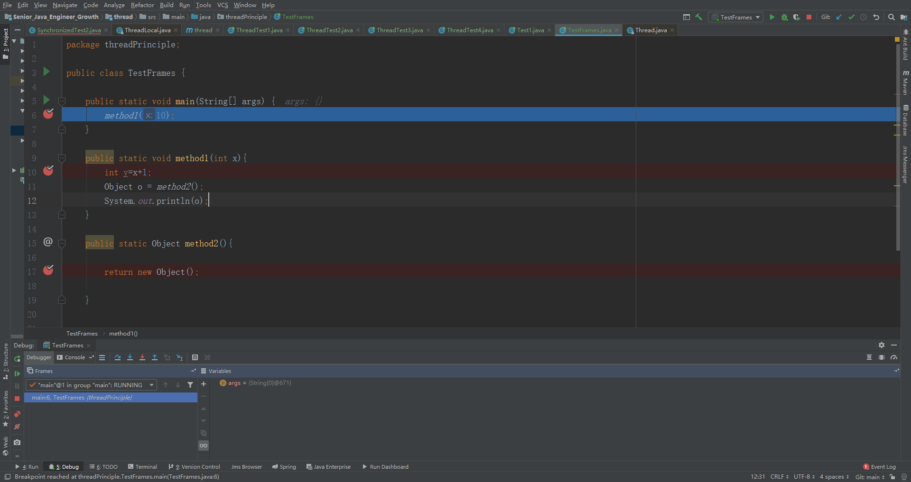
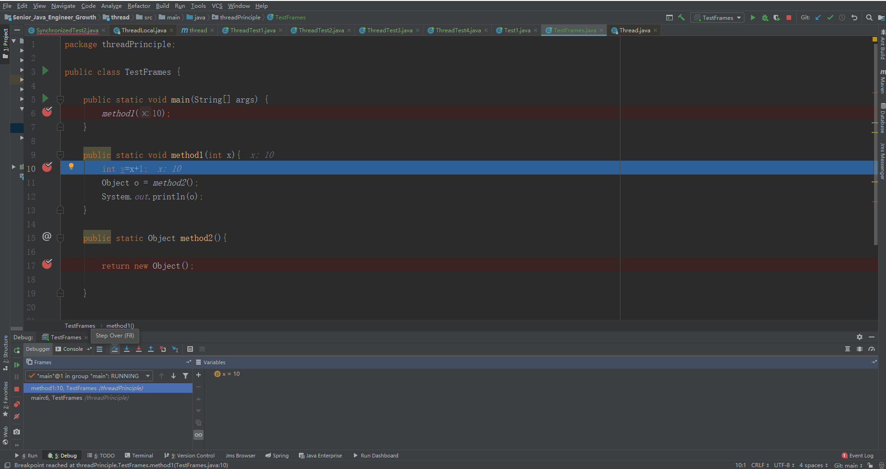
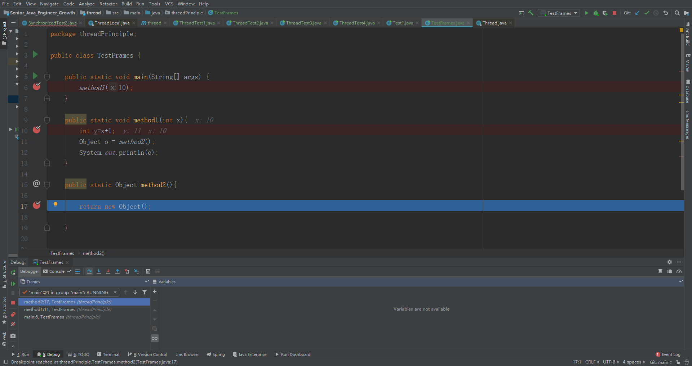
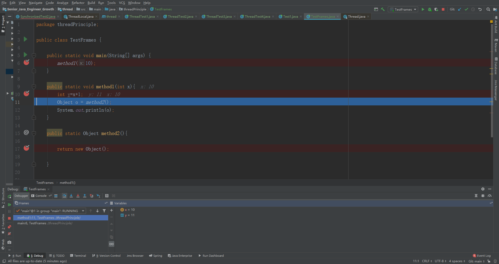
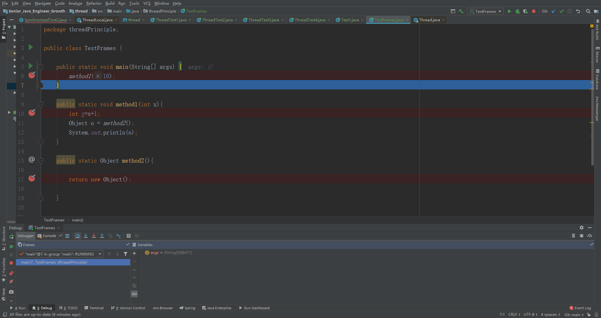
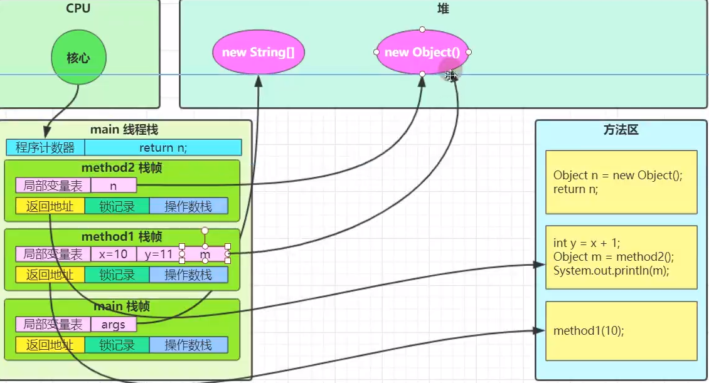

## 一、进程与线程

### 1、进程

· 程序由指令和数据组成，但这些指令要运行，数据要读写，就必须将指令加载到CPU，数据加载至内存，在指令运行过程中还需要用到磁盘、网络等设备。进程就是用来加载指令、管理内存、管理io的。

· 当一个程序被运行，磁盘加载这个程序的代码到内存中，这个时候就开启一个进程

· 进程就可以视为程序的一个实例。大部分程序可以同时运行多个实例进程(例如 tomcat 服务)，也有的程序只能开启一个进程，例如 网易云音乐

### 2、线程

· 一个进程由一个或者多个线程组成

· 一个线程就是指令流，将指令中的一条条指令以一定的顺序交给CPU执行

· java中，线程作为最小调度单位，进程作为资源分配的最小单位。

### 3、两者对比

· 进程基本上互相独立的，而线程存在于进程内，是进程的一个子元素

· 进程拥有共享的资源，例如内存空间等，供其内部的线程共享

· 进程间通信较为复杂：

​		同一台计算机的进程通信成为IPC (Inner-process Comminication)

​        不同计算机之间的进程通信，需要通过网络，并遵守共同的协议，例如http

· 线程之间的通信相对简单，因为它们共享进程内的内存，一个例子就是多个线程访问一个公共变量

· 线程更加轻量，线程切换上下文成本要比线程切换上下文的成本要低

## 二、并行和并发

###  1、并发

单核CPU下，线程实际还是串行执行的。操作系统中有一个组件叫做任务调度器，将CPU的时间片(windows下时间片最小为15ms)分给不同的线程使用，只有由于cpu在线程间(时间片很短)的切换非常快，人类的直接感觉是同时运行的。总结一句话就是围观串行，宏观并行。一般我们将这种线程轮流使用CPU的做法简称为并发(concurrent)

### 2、并行

在多核CPU下，每个CORE都可以调度运行线程，这时候线程可以同时运行

## 三、同步与异步

### 1、同步

 按照顺序执行，等待前一行代码执行完成后再执行下一行代码。也就是等待结果返回，才能继续运行

### 2、异步

程序中某一行代码特别耗时，但是他的执行结果与下面代码无关，这个时候我们就可以对这个一行很耗时的代码进行异步操作。java中异步只能通过开启新的线程来实现

## 四、java线程

### 1、创建和运行线程

第一种方式

```java
    public static void main(String[] args) {
        Thread thread = new Thread() {
            @Override
            public void run(){
                System.out.println(Thread.currentThread().getName()+":running");
            }
        };
        thread.setName("t1");
        thread.start();
        System.out.println(Thread.currentThread().getName()+":running");
    }
```

第二种创建方式

```java
 public static void main(String[] args) {
        Runnable runnable = new Runnable() {
            public void run() {
                System.out.println(Thread.currentThread().getName()+":running");
            }
        };

        Thread thread = new Thread(runnable);
        thread.setName("t2");
        thread.start();
        System.out.println(Thread.currentThread().getName()+":running");

    }
```

第三种创建方式

```java
    public static void main(String[] args) {
        new Thread(()->{
            System.out.println(Thread.currentThread().getName() + ":running");
        },"t3").start();
        System.out.println(Thread.currentThread().getName() + ":running");
    }
```

第四种创建方式

```java
public static void main(String[] args) throws  Exception{
        FutureTask<Integer> task = new FutureTask<>(new Callable<Integer>() {
            @Override
            public Integer call() throws Exception {
                System.out.println(Thread.currentThread().getName() + ":running");
                return 100;
            }
        });
        Thread thread = new Thread(task);
        thread.setName("t4");
        thread.start();
        System.out.println(Thread.currentThread().getName() + ":running");
        Integer integer = task.get(); //获取线程执行返回的结果
        System.out.println(integer);
    }
```

### 2、强行关闭线程

windows

```shell
C:\Users\16585>jps
7696 Test1
12516 Launcher
14212 Jps
1732
4532 KotlinCompileDaemon
14028 RemoteMavenServer

C:\Users\16585>taskkill /F /PID 7696
成功: 已终止 PID 为 7696 的进程。
```

### 3、线程运行的原理

#### 3.1 栈和栈帧

· 每个栈由多个栈帧组成，对应每次方法调用时所占用的内存

· 每个线程只能拥有一个活动栈帧，对应着当前正在执行的那个方法

##### 3.1.1 一个线程执行时的内存分析

```JAVA
	public static void main(String[] args) {
        method1(10);
    }

    public static void method1(int x){
        int y=x+1;
        Object o = method2();
        System.out.println(o);
    }

    public static Object method2(){
        return new Object();
    }
```


进入debug



可以看debug	区域出现了一个栈帧，右侧为这个栈帧中的参数



走debug走进method1就会发现当前线程又增加了一个栈帧



进入method2后又会增加一个栈帧

****

继续执行就会发现，method2的栈帧已经不在内存中了



执行完method1后method1的栈帧也消失了

**由此我们可以得出一个结论**

```
JVM会给每一个正在执行的方法分配一个独立的栈帧。
```



##### 3.1.2 多个线程运行时的内存分析

就是一个线程运行时的内存分析的两个过程

#### 3.2  线程上下文切换

因为以下一些原因导致CPU不再执行当前的线程，转而执行另一个线程的代码

· 线程的CPU时间片使用完

· 垃圾回收开启

· 有更高优先级的线程需要运行

· 线程自己调用了sleep,yield,wait,join,park,synchronized.lock等方法


当Context Switch发生是，需要由操作系统保存 当前线程的状态，并恢复另外一个线程的状态，java中对应的概念就是程序计数器，他的作用就是记住下一条jvm指令的执行地址，是线程私有的

· 状态包括程序计数器，虚拟机栈中每个栈帧的信息，如局部变量、操作数栈，返回地址等

· Context Swtich频繁发生会影响性能

## 五、start与run

### 1、start()

```
· 启动一个新线程，在新的线程运行run方法中的代码。
· start方法只是让线程进入可执行状态，里面的代码不一定会立刻执行，只有线程获取到CPU的时间片才会执行run方法中的代码
· 每个线程对象的start方法只能调用一次，调用多次就会出现IllegalThreadStateException
```

### 2、run方法

```
当前线程获取到CPU的时间片才会执行的代码。
单纯调用线程对象的run方法不会开启新线程，只会把Thread当成一个普通对象
```

## 六、sleep与yeild

### 1、sleep

```
· 调用sleep方法会让当前线程从Running状态进入TimedWating状态
· 其他线程可以使用interrupt方法打断正在睡眠的线程。这是sleep方法会抛出InterruptException
· 睡眠结束后的线程未必会立即得到执行
· 建议使用TimeUnit的sleep代替Thread的sleep，来获得更好的可读性
· 当线程使用到锁后，sleep方法是不会释放锁的
```

### 2、yeild

```
· 调用yeild会让当前 线程从Running状态进入runnable状态，然后调度执行其他同优先级的线程，如果这时候没有同优先级的线程，那么就不能保证让当前线程的效果，当前线程可能继续获取到CPU时间片，继续执行
· 具体的实现依赖于操作系统的任务调度
```

